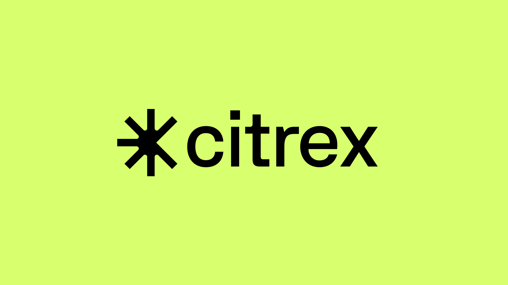

<p align="center">
  
</p>

Interact with the [Citrex Perpetual Exchange](https://app.citrex.markets/) and trade BTC, ETH, SEI and other cryptocurrency perp futures with leverage. Live on [Sei](https://sei.io/).

```bash
npm install citrex-sdk
# or
yarn add citrex-sdk
# or
pnpm add citrex-sdk
# or
bun install citrex-sdk
```

## Usage

Getting started is a simple case of creating a .env file, importing the Client and instantiating an instance.

The .env file should contain the necessary contract addresses to interact with the DEX. An up-to-date copy of the relevant contract addresses can be found in the [Citrex API docs](https://citrex.readme.io/).

```sh
CIAO_MAINNET_ADDRESS=<0x7461cFe1A4766146cAFce60F6907Ea657550670d>
ORDER_DISPATCH_MAINNET_ADDRESS=<0x993543DC8BdFCba9fc7355d822108eF49dB6b9F9>

CIAO_TESTNET_ADDRESS=<...>
ORDER_DISPATCH_TESTNET_ADDRESS=<...>
```

```ts
import CitrexSDK from 'citrex-sdk'

const MY_PRIVATE_KEY = '0x...'

const Client = new CitrexSDK(MY_PRIVATE_KEY)
```

The client can also accept a configuration object as the second parameter.

| Key          | Type                     | Default                           | Description                                                               |
|--------------|--------------------------|-----------------------------------|---------------------------------------------------------------------------|
| debug        | `boolean`                | `false`                             | Used to enable debug mode when running the client for additional logging. |
| environment  | `'testnet' \| 'mainnet'` | `'testnet'`                         | Specify the environment you wish to trade in.                             |
| rpc          | `string`                 | `Sei RPC based on environment` | Specify a custom RPC url to used.                                         |
| subAccountId | `number`                 | `1`                                 | Specify a sub-account ID to use. This can be from 1-255.                  |

```ts
import CitrexSDK from 'citrex-sdk'

const CONFIG = {
  debug: false,
  environment: 'mainnet',
  rpc: 'https://evm-rpc.sei-apis.com',
  subAccountId: 1,
}
const MY_PRIVATE_KEY = '0x...'

const Client = new CitrexSDK(MY_PRIVATE_KEY)
```

## Getting started

To get started, you will need to deposit funds and make a trade. Let's look at how we can do that now.

```ts
import CitrexSDK from 'citrex-sdk'
import { OrderType, TimeInForce } from 'citrex-sdk/enums'

const MY_PRIVATE_KEY = '0x...'

const Client = new CitrexSDK(MY_PRIVATE_KEY)

// Let's deposit 1000 USDC to get started. By default deposits are in USDC.
const { error, success, transactionHash } = await Client.deposit(1000)

// Now we can make an order. Let's go long on some ETH!
if (success) {
  const { error, order } = await Client.placeOrder({
    isBuy: true,
    orderType: OrderType.LIMIT,
    price: 3150,
    productId: 1002,
    quantity: 0.1,
    timeInForce: TimeInForce.GTC,
  })

  // Finally let's log out our order to check the details.
  console.log(order)
}
```

### Handy enums

A series of useful enums can be imported from `citrex-sdk/enums` and used to help match against responses or compose payloads.

| Name         | Values                                                                                   | Description                                          |
|--------------|------------------------------------------------------------------------------------------|------------------------------------------------------|
| Environment  | `MAINNET \| TESTNET`                                                                     | The environment to use when initialising the client. |
| Interval     | `'1M' \| '5M' \| '15M' \| '30M' \| '1H' \| '2H' \| '4H' \| '8H' \| '1D' \| '3D' \| '1W'` | The interval to use when fetching K-line data.       |
| MarginAssets | `USDC`                                                                                   | Symbol values of supported margin assets.            |
| OrderStatus  | `CANCELLED \| EXPIRED \| FILLED \| OPEN \| PENDING \| REJECTED`                          | Defines the possible states an order can be in.      |
| OrderType    | `LIMIT \| LIMIT_MAKER \| LIMIT_REDUCE_ONLY \| MARKET`                                    | Order types for building order payloads.             |
| TimeInForce  | `GTC \| FOK \| IOC`                                                                      | Time in force values for building order payloads.    |

### Importing types

If you are developing using TypeScript, or you require access to the typings used in the SDK, they can be imported from `citrex-sdk/types`.

### Further support

For more information on specific endpoints, please refer to the official [Citrex API docs](https://citrex.readme.io/). Each function in this client contains detailed JSDocs on arguments and return types to aid the developer experience and links to their respective endpoints within the official docs.

## Support

Trouble getting started? Feel free to join us on the official [Twitter Account](https://x.com/citrex_markets/) where you can get full support from the team.

## License

MIT License © 2024-Present
